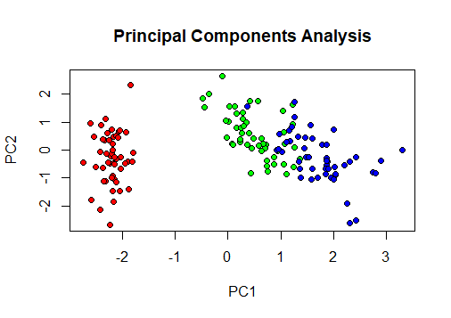

## dr package

### Description
Wrappers of various dimension reduction algorithms. Data after dimension reduction can also be easily visualized.

Algorithms that can be used in `dr` package are `Principal Components Analysis`, `Kernel Principal Components Analysis`, `Classical Multidimensional Scaling`, `t-Distributed Stochastic Neighbor Embedding`, `Locally linear embedding`, `Self-Organizing Map` and `Diffusion Map`.

### Installation
You can install from R console.

If `devtools` is not installed on your PC, install `devtools` with Internet connection.

    install.packages("devtools")

Install from GitHub using `devtools`.
    
    library(devtools)
    install_github("ToshihiroIguchi/dr")

Load the `dr` package and attach it.

    library(dr)


### Examples
We show a concrete example of `dr` package in iris`.
Like the `lm` function, it can be written in formula form like objective variable and explanatory variable.
In the `dr` package, you can analyze it without including the object variable.
Both numerical values and factors can be entered for object variables and explanatory variables.

    result <- dr(Species ~ Sepal.Length + Sepal.Width + Petal.Length + Petal.Width, data = iris)

Dimension reduction is performed by inputting the above command.
The result can be confirmed with the plot function.

    plot(result)

For reference, only the result of `Principal Components Analysis` is shown.




### License 

```
MIT License

Copyright (c) 2018 Toshihiro Iguchi

Permission is hereby granted, free of charge, to any person obtaining a copy
of this software and associated documentation files (the "Software"), to deal
in the Software without restriction, including without limitation the rights
to use, copy, modify, merge, publish, distribute, sublicense, and/or sell
copies of the Software, and to permit persons to whom the Software is
furnished to do so, subject to the following conditions:

The above copyright notice and this permission notice shall be included in all
copies or substantial portions of the Software.

THE SOFTWARE IS PROVIDED "AS IS", WITHOUT WARRANTY OF ANY KIND, EXPRESS OR
IMPLIED, INCLUDING BUT NOT LIMITED TO THE WARRANTIES OF MERCHANTABILITY,
FITNESS FOR A PARTICULAR PURPOSE AND NONINFRINGEMENT. IN NO EVENT SHALL THE
AUTHORS OR COPYRIGHT HOLDERS BE LIABLE FOR ANY CLAIM, DAMAGES OR OTHER
LIABILITY, WHETHER IN AN ACTION OF CONTRACT, TORT OR OTHERWISE, ARISING FROM,
OUT OF OR IN CONNECTION WITH THE SOFTWARE OR THE USE OR OTHER DEALINGS IN THE
SOFTWARE.
```

### Auther
Toshihiro Iguchi
